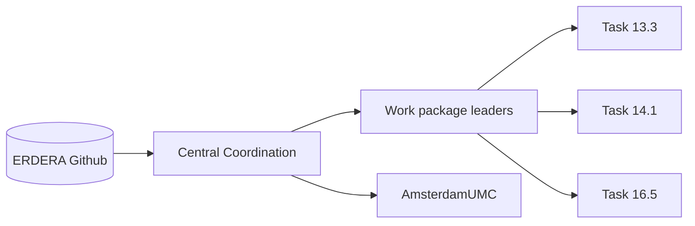

# ERDERA Github central coordination
Welcome to the central coordination repository for the ERDERA project. This repository is used to coordinate the development of the project and to provide a central point of contact for the project.

## Github coordinators
The following people are the coordinators for this Github repository:
- [Andra Waagmeester (AmsterdamUMC)](https://github.com/andrawaag)
- [Luiz Olavo Bonino da Silva Santos (UTwente)](https://github.com/luizbonino)
- [Mark Hanauer (Orphanet)](https://github.com/orgs/ERDERA/people/Orphanet)
- [Heena Lad](https://github.com/orgs/ERDERA/people/HeenaLad)
- [Ronald Cornet (AmsterdamUMC)](https://github.com/orgs/ERDERA/people/ronaldcornet)

## Purpose
This repository is used govern the github organization and to provide a central point of contact for the project. The repository is used mainly used to request new teams, repositories and to provide a central point of contact for the project.
It is also possible to request a clone of a repository from the previous EJP RD project.

### Forms
- [Request a new team]()
- [Request a new repository](https://github.com/ERDERA/Central-coordination/issues/new?)
- [Request a clone of a repository from the previous EJP RD project](https://github.com/ERDERA/Central-coordination/issues/new?assignees=&labels=&projects=&template=GitHub_Fork_Clone_request.yml&title=%5BRelocate+Repository%5D%3A+%5BSource+Repo+Name%5D)

### Teams
A github team is a group of people that have access to a set of repositories. The teams are used to manage the access to the repositories. The following teams are currently available in the ERDERA github organization: [Teams](https://github.com/orgs/ERDERA/teams)

### Current repositories

- To request new teams, please contact anyone from the central coordination team.
- To request a new repository, please use the [Request a new repository](https://github.com/ERDERA/Central-coordination/issues/new?) form

# Central coordination
Availability: private
- [Andra Waagmeester (AmsterdamUMC)](https://github.com/andrawaag)
- [Luiz Olavo Bonino da Silva Santos (UTwente)](https://github.com/luizbonino)
- [Mark Hanauer (Orphanet)](https://github.com/orgs/ERDERA/people/Orphanet)
- [Heena Lad](https://github.com/orgs/ERDERA/people/HeenaLad)
- [Ronald Cornet (AmsterdamUMC)](https://github.com/orgs/ERDERA/people/ronaldcornet)

# Work package leaders
#Todo: Add the work package leaders

# AmsterdamUMC
Availability: private
- [Andra Waagmeester (AmsterdamUMC)](https://github.com/andrawaag)
- [Ronald Cornet (AmsterdamUMC)](https://github.com/ronaldcornet)
- [Nirupama Benis (AmsterdamUMC)](https://github.com/nirupamabenis)

# Task 13.3
Availability: public
- [Nirupama Benis (AmsterdamUMC)](https://github.com/nirupamabenis)

# Task 14.1
Availability: public
- [Nirupama Benis (AmsterdamUMC)](https://github.com/nirupamabenis)
- [Andra Waagmeester (AmsterdamUMC)](https://github.com/andrawaag)

# Task 16.5
Availability: public
- [Andra Waagmeester (AmsterdamUMC)](https://github.com/andrawaag)
- [Mark Hanauer (Orphanet)](https://github.com/orgs/ERDERA/people/Orphanet)