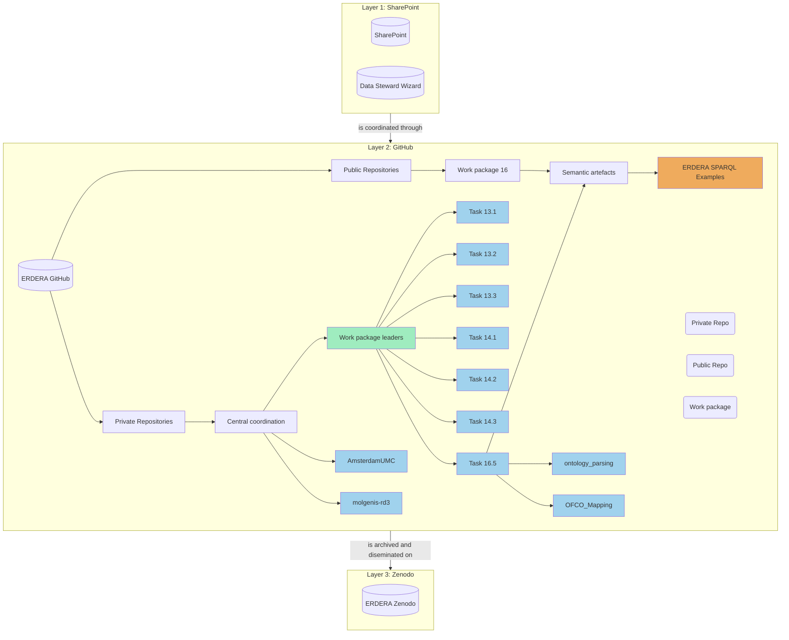

# ERDERA Github central coordination

## Table of Contents
- [Introduction to the ERDERA GitHub Structure and Governance](#introduction-to-the-erdera-github-structure-and-governance)
- [Governance of Repository Creation](#governance-of-repository-creation)
- [ERDERA GitHub Layers](#erdera-github-layers)
- [Navigating and using the ERDERA GitHub](#navigating-and-using-the-erdera-github)
    - [Teams](#teams)
    - [Projects](#projects)
    - [Repositories](#repositories)
    - [Github through the Layers](#github-through-the-layers)
- [How to Engage](#how-to-engage)
    - [Forms](#forms)
- [👥 GitHub Coordinators](#-github-coordinators)
- [Repositories details coordination](#repositories-details-coordination)
- [Private GitHub Repositories](#private-github-repositories)
  - [Central Coordination](#central-coordination)
  - [Work Package Leaders](#work-package-leaders)
  - [AmsterdamUMC](#amsterdamumc)
  - [Task 13.3](#task-133)
  - [Task 14.1](#task-141)
  - [Task 16.5](#task-165)
- [Public GitHub Repositories](#public-github-repositories)
  - [Work Package 16](#work-package-16)
  - [Semantic Artefacts](#semantic-artefacts)
    - [Description](#description)

## Introduction to the ERDERA GitHub Structure and Governance

The ERDERA GitHub organization serves as the backbone for coordinating the digital resources and collaborative efforts of the ERDERA project. Designed to streamline the development, dissemination, and governance of various work packages and deliverables, the GitHub structure integrates multiple repositories and teams tailored to address specific tasks and objectives within the project.

At the core of this structure is the **central coordination repository**, which acts as the hub for managing the GitHub organization. It ensures collaboration by standardizing processes such as requesting new repositories, forming teams, and managing access rights. The repository also facilitates cloning and adapting resources from the prior EJP RD project, thus ensuring continuity and leveraging past work.

##  Governance of Repository Creation

The ERDERA GitHub organization operates under a distributed governance structure, which ensures that responsibilities for repository creation are shared among central coordination, work package leaders (WPL), and task leaders. This decentralized approach facilitates efficient collaboration and ensures that repositories are created in alignment with project needs and objectives.

Roles and Responsibilities for Repository Creation :
| `Role`                      | `Responsibilities` |
|---------------------------|-----------------|
| **Central Coordination Team** | - **Oversee structure**: Manages the overall organization of the ERDERA GitHub. - **Set guidelines**: Maintains repository naming conventions, access control, and usage policies. - **Support repository creation**: Facilitates repositories for cross-cutting tasks or central infrastructure needs. - **Handle special requests**: Manages cloning of repositories from the EJP RD project. |
| **Work Package Leaders (WPL)** | - **Create repositories**: Authorized to establish repositories for their work packages. - **Ensure alignment**: Guarantees that repositories meet deliverables and objectives. - **Manage access**: Controls permissions for their work package team. |
| **Task Leaders** | - **Issue task-specific repositories**: Can create repositories tailored to their task needs. - **Define scope and structure**: Ensures repositories are appropriately focused. - **Coordinate practices**: Works with WPLs and central coordination for consistency. |

##  ERDERA GitHub Layers

The ERDERA infrastructure is organized into **three primary layers** to provide *clarity* and *functional separation*:

| `Layer`      | `Purpose` | `Key Functions` |
|---------------|------------|------------------|
| **Layer 1: SharePoint** | **Collaboration & Documentation** | - Centralized document management. - File sharing and storage for project materials. |
| **Layer 2: GitHub** | **Heart of Technical Coordination** | - Core development platform. - Hosts private, public, and semantic artifacts repositories. - Supports **SPARQL examples**, **semantic models**, and other essential resources. |
| **Layer 3: Zenodo** | **Archiving & FAIR Compliance** | - Ensures **long-term availability** and **accessibility** of project deliverables. - Aligns with **FAIR principles** (Findable, Accessible, Interoperable, and Reusable). |

## Navigating and using the ERDERA GitHub
### Teams
A github **team** is a group of people that have access to a set of repositories. The teams are used to manage the access to the repositories.
> The following teams are currently available in the ERDERA github organization: [Teams](https://github.com/orgs/ERDERA/teams)

### Projects
A **project** is a task management tool within a repository that helps organize and track progress toward goals.
> The following Projects are currently available ERDERA github organization: [Projects](https://github.com/orgs/ERDERA/projects)

### Repositories
A **repository** is a storage space for code, resources, or documentation related to a specific project or task.

> The following Repositories are currently available ERDERA github organization: [Repositories](https://github.com/orgs/ERDERA/repositories)

### Github through the Layers

## How to Engage

To promote transparency and collaboration, ERDERA provides simple mechanisms for partners to request new resources or include existing repositories from EJP-RD and other related projects:
- ***New Team Requests***: Facilitates the formation of teams with clearly defined access permissions.
- ***New Repository Requests***: Allows contributors to propose new repositories for specific tasks or deliverables.
- ***Repository Cloning***: Enables the reuse of resources from the EJP RD project to build on prior work.

By leveraging these mechanisms, partners can efficiently create, manage, and access the digital resources needed to drive the ERDERA project forward. The ERDERA GitHub organization is designed to support the collaborative efforts of the project partners and ensure the successful development and dissemination of project deliverables.

### Forms
- [Request a new team]()
- [Request a new repository](https://github.com/ERDERA/Central-coordination/issues/new?)
- [Request a clone of a repository from the previous EJP RD project](https://github.com/ERDERA/Central-coordination/issues/new?assignees=&labels=&projects=&template=GitHub_Fork_Clone_request.yml&title=%5BRelocate+Repository%5D%3A+%5BSource+Repo+Name%5D)

## 👥 Github coordinators
The following people are the coordinators for this Github repository:
- [Andra Waagmeester (AmsterdamUMC)](https://github.com/andrawaag)
- [Luiz Olavo Bonino da Silva Santos (UTwente)](https://github.com/luizbonino)
- [Mark Hanauer (Orphanet)](https://github.com/orgs/ERDERA/people/Orphanet)
- [Heena Lad](https://github.com/orgs/ERDERA/people/HeenaLad)
- [Ronald Cornet (AmsterdamUMC)](https://github.com/orgs/ERDERA/people/ronaldcornet)

## Repositories details coordination
### Private GitHub repositories
#### Central coordination
- [Andra Waagmeester (AmsterdamUMC)](https://github.com/andrawaag)
- [Luiz Olavo Bonino da Silva Santos (UTwente)](https://github.com/luizbonino)
- [Mark Hanauer (Orphanet)](https://github.com/orgs/ERDERA/people/Orphanet)
- [Heena Lad](https://github.com/orgs/ERDERA/people/HeenaLad)
- [Ronald Cornet (AmsterdamUMC)](https://github.com/orgs/ERDERA/people/ronaldcornet)

#### Work package leaders
#Todo: Add the work package leaders

#### AmsterdamUMC
Availability: private
- [Andra Waagmeester (AmsterdamUMC)](https://github.com/andrawaag)
- [Ronald Cornet (AmsterdamUMC)](https://github.com/ronaldcornet)
- [Nirupama Benis (AmsterdamUMC)](https://github.com/nirupamabenis)

#### Task 13.3
Availability: public
- [Nirupama Benis (AmsterdamUMC)](https://github.com/nirupamabenis)

#### Task 14.1
Availability: public
- [Nirupama Benis (AmsterdamUMC)](https://github.com/nirupamabenis)
- [Andra Waagmeester (AmsterdamUMC)](https://github.com/andrawaag)

#### Task 16.5
Availability: public
- [Andra Waagmeester (AmsterdamUMC)](https://github.com/andrawaag)
- [Mark Hanauer (Orphanet)](https://github.com/orgs/ERDERA/people/Orphanet)

### Public GitHub repositories
#### Work package 16
- [Andra Waagmeester (AmsterdamUMC)](https://github.com/andrawaag)

#### Semantic artefacts
- [Andra Waagmeester (AmsterdamUMC)](https://github.com/andrawaag)
##### Description
SPARQL examples is intended to be a collection of SPARQL examples for various ERDERA projects. This repository is a fork of the [SIB-Swiss sparql-examples repository](https://github.com/sib-swiss/sparql-examples) and follows the same structure and guidelines. The repository is used to store SPARQL queries in a structured way, with each query stored in a separate file. The queries are stored in the examples folder, with each project having its own subfolder. The repository also contains a README file with information about the project and how to contribute to it.
